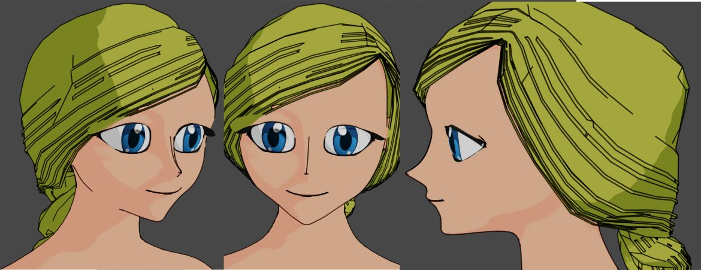
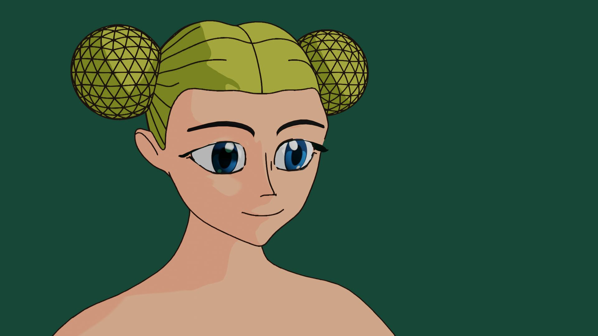

Estoy tratando de buscar imitar el estilo anime en **Blender**, como no tengo el personaje del corto aún, usé **MakeHuman** para generar la malla y poder hacer pruebas. Por ahora estoy satisfecho con el resultado. Las líneas se dibujan muy bien. Tres dibujos en 3 segundos, a comparación con el FreeStyle que sí se tomaba su tiempo y configurarlo es un dolor de cabeza.

 

SALUDOS  
Met...
